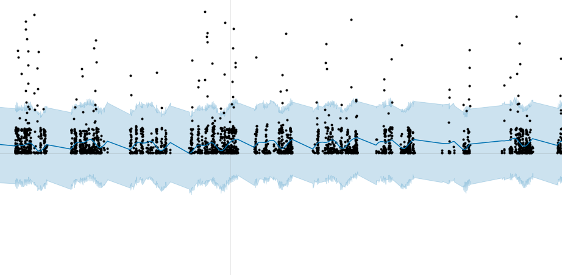

# Anomaly-detection-example
Unsupervised anomaly detection test task from Welltory using Prophet. [nbviewer](https://nbviewer.jupyter.org/github/kondrasso/Anomaly-detection-example/blob/master/Welltory_test.ipynb) is recommended to view due to large amount of interactive plots.

Basic idea - tweak Prophet for subday trend detection and prediction, take 99% interval of prediction and consider everything outside its borders as anomaly, as well as calculating anomalys weigth via proximity to Prophet's border. To handle days with low or without activity at all, comparing days mean amout  of steps with average, as well as number of inputs on the given day.  
Complete interactive visualisation can be seen via [nbviewer](https://nbviewer.jupyter.org/github/kondrasso/Anomaly-detection-example/blob/master/Welltory_test.ipynb) (or you can just see final graph in figure.html)
